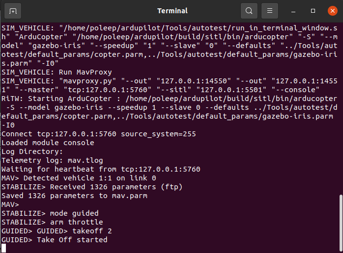

# Description
Experimental simulation environment in ROS for drone navigation with MoveIt!, using 2D Lidar and ultrasonic sensors.

## Project Overview
The modified version of the MoveIt! planning framework is used in this project to support aerial navigation, using OMPL's path planning algorithms for three-dimensional path planning, integrating it with the drone's control system.
ArduPilot SITL is used for simulating the flight controller of the drone and MAVROS is used as a bridge between ROS nodes and the flight controller. The drone, sensors and obstacles are simulated in Gazebo.

The drone has a 2D Lidar on top, this is used for creating a detailed OctoMap of its surroundings. This map is crucial for the initial path planning, providing a comprehensive layout of the environment. The drone can't execute automatic mapping, it has to be controlled manually to fly around in manual control mode using a teleop node for controlling the drone. Once the the map is ready, a 3D path can be generated and executed using MoveIt! through Rviz.

## Installation and Setup Instructions
This package was tested with ROS Noetic and Ubuntu 20.04.
To get rid of the performance overhead, it is recommended to use Ubuntu installed natively instead of using a VM.
If you don't have ROS installed, here is a detailed guide on how to install it https://wiki.ros.org/noetic/Installation/Ubuntu

### catkin_ws
Skip this section if you already have a catkin_ws.

Create a workspace directory
```
mkdir -p ~/catkin_ws/src
cd ~/catkin_ws
```
If you haven't installed catkin_tools yet, you can do so
```
sudo apt-get update
sudo apt-get install python3-catkin-tools
```

Initialize and build the catkin workspace
```
catkin init
catkin build
```
Source the setup file in the devel director, this will make the workspace visible to ROS
```
source ~/catkin_ws/devel/setup.bash
```


### Install dependencies for packages
```
sudo apt-get update
sudo apt install git ros-noetic-ompl ros-noetic-tf2-sensor-msgs
```

### Clone and build this repository
```
cd ~/catkin_ws/src
git clone https://github.com/danielhorti/drone-nav.git
```
```
cd ~/catkin_ws/
catkin build
source ~/catkin_ws/devel/setup.bash
```

### ArduPilot
Clone the official ArduPilot repository
```
cd ~
git clone https://github.com/ArduPilot/ardupilot.git
cd ardupilot
```

Install dependencies
```
cd ardupilot
Tools/environment_install/install-prereqs-ubuntu.sh -y
```

Reload profile
```
. ~/.profile
```

ArduCopter 4.3.4 was used for testing
```
git checkout Copter-4.3.4
git submodule update --init --recursive
```

Start ArduPilot SITL to set params
```
cd ~/ardupilot/ArduCopter
sim_vehicle.py -w
```

### Gazebo
Accept software from http://packages.osrfoundation.org
```
sudo sh -c 'echo "deb http://packages.osrfoundation.org/gazebo/ubuntu-stable `lsb_release -cs` main" > /etc/apt/sources.list.d/gazebo-stable.list'
```

Setup keys
```
wget http://packages.osrfoundation.org/gazebo.key -O - | sudo apt-key add -
```

Reload software list
```
sudo apt update
```

Install Gazebo (Ubuntu 20.04)
```
sudo apt-get install gazebo11 libgazebo11-dev
```


Install Gazebo plugin for APM (ArduPilot Master)
```
cd ~
git clone https://github.com/khancyr/ardupilot_gazebo.git
cd ardupilot_gazebo
```

Build and install plugin
```
mkdir build
cd build
cmake ..
make -j4
sudo make install
```
```
echo 'source /usr/share/gazebo/setup.sh' >> ~/.bashrc
```

Setup paths for models
```
echo 'export GAZEBO_MODEL_PATH=~/ardupilot_gazebo/models:~/catkin_ws/src/drone-nav/iq_sim/models' >> ~/.bashrc
. ~/.bashrc
```
## Running the simulation
After setting up everything successfully, the simulation is ready to be launched.
You can launch the nodes and scripts one by one or use the provided simulation launch script.
This launch script will start every component and open new windows such as Gazebo, Rviz and ArduPilot SITL.
```
~/catkin_ws/src/drone-nav/launch_simulation.sh
```
Wait until everything is up and running, this may take some time.
A Gazebo world is being launched with a warehouse, few shelfs and boxes.
New terminal windows pop up, the drone is initializing communication and mavros is being launched as well.
First you need to make sure the drone is ready to take off.
For this, check Rviz and make sure of that there are no TF tree related errors. This is crucial for mapping and navigation.

Once the drone is ready to fly and the sensor readings are being displayed in Rviz, it's time to take off the drone.
Use the SITL terminal to arm the drone and take off.
Open the terminal, press ENTER and type:
```
mode guided
```
```
arm throttle
```
```
takeoff 2
```


**Notice**: Make sure you don't wait for too long after arming the drone, because it may stop spinning the propellers and won't take off.

Now the drone is in the air and ready to fly around.
For that, you may use the keyboard by launching the teleop node:
```
~/catkin_ws/src/drone-nav/iq_sim/scripts/move_drone.py
```

### Mapping and navigation
The drone keeps mapping it's environment with the 2D lidar on the top of the drone. You can see in Rviz how the map is being extended as the drone moves around.
Launch and use the teleop node for moving the drone manually. Creating a map of the environment is needed for path planning and navigation.

Use the MoveIt! MotionPlanning display in Rviz for planning and executing a path.
Set the goal pose by dragging the state marker to a desired position and make sure to set the start state "current". Verify that the poses are where they should be and adjust if needed.
If the poses are good, you can press the "Plan and Execute" button to plan the path and execute trajectory.
